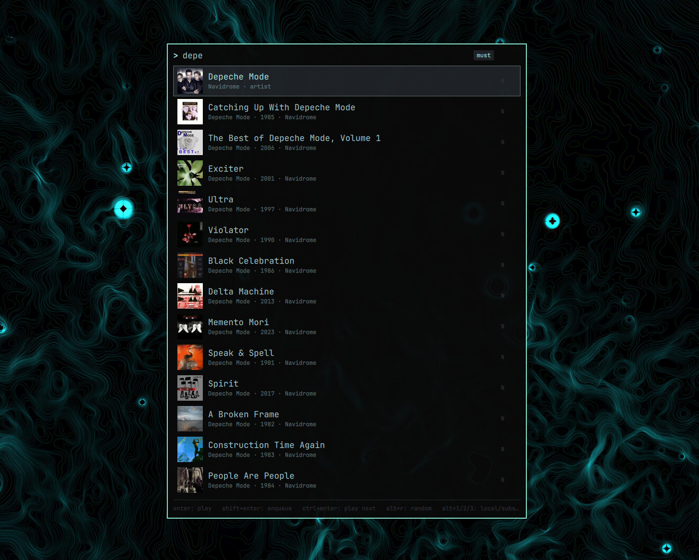
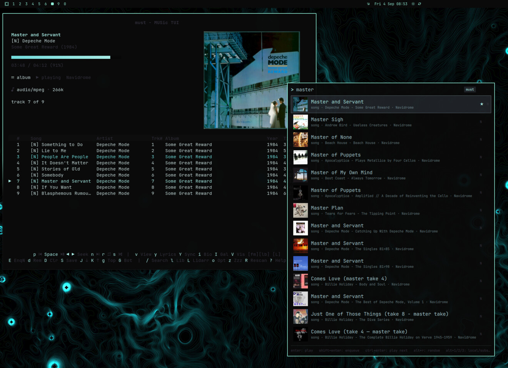

# amla — advanced music launcher
<br clear="left">

Searchable music launcher plugin for Omarchy 4 (Quattro): `SUPER + M` opens a popup
over your catalog — local library, temp/download albums, and Subsonic
(Navidrome): artists, albums, songs, genres, years/decades, playlists.
Favorites learn from your play history and surface as you type. Dispatches to
**cliamp** (default), **must**, or **MPD** (see below). Pure QML plugin, MIT licensed.



## Players: cliamp, must, or MPD (any, some, or all)

- **cliamp** ships with Omarchy and works out of the box — amla targets it by
  default (requires cliamp v2+ for the `url.load` / `track.*` / `queue.*` IPC
  ops; v1 CLIs differ and are not supported). Play, enqueue, and play-next
  all work; multi-item lists go through generated m3us.
- **[must - music TUI](https://github.com/pdfrg/must)** (≥ 0.2.3) is worth a look:
  library search and browser, album art, artist art, and artist galleries
  (in the terminal), artist bios, and vim-style keybindings. It needs a Go toolchain
  to build, but amla's must support runs deepest — native catalog resolvers,
  playshuffle, scoped random, rescan — because the two were developed
  together. Cycle to it with `Ctrl+T` inside the popup. amla finds the
  binary via `mustBin` in its own config, else `command -v must` — so if
  you installed with `go install` and `~/go/bin` isn't on your `PATH`,
  either add it or set `"mustBin": "/home/you/go/bin/must"` (full path,
  no `~`) in `~/.config/amla/config.json`.



- **MPD** (via `mpc` + the user-service daemon) takes the same catalog:
  play, enqueue, play-next, playshuffle, random albums, playlists — local
  files queue by path, Subsonic items as tagged stream URLs with preloaded
  Artist/Album/Title/Track/Date (stream durations can't be set through the
  MPD protocol — a daemon limitation, not an amla gap). Playshuffle keeps
  the queue in album/track order and switches the daemon to random mode,
  like the other targets. No TUI to launch: an unreachable daemon notifies
  instead. For a TUI, the recommended client is
  [rmpc](https://github.com/mierak/rmpc): amla ships an `rmpc_art.py`
  `album_art.custom_loader` hook so Subsonic streams render cover art
  in-pane (song id is parsed from the stream URL → Navidrome `getCoverArt`;
  local-file art is untouched). Enable it with
  `custom_loader: ["<plugin-dir>/rmpc_art.py"]` under `album_art` in your
  rmpc config — the key is inert on stable v0.11, so one config works on
  both. Tested and working on dev builds past v0.11 (custom-loader support
  landed upstream 2026-02-06); stable v0.11 ignores the key and streams
  simply show no art.

A Subsonic/Navidrome server is optional — configure it in must
(`[subsonic]`), cliamp (`[navidrome]`), or amla's own config
(`subsonicUrl`/`subsonicUser`/`subsonicPass` as last resort) and amla
searches it too; without any of those amla is local-only and never touches
the network. MPD-only with no must or cliamp config? amla's own keys are
the whole setup (`~/.config/amla/config.json`, then `omarchy restart shell`):

```json
{
  "targetPlayer": "mpd",
  "subsonicUrl": "http://192.168.1.XYZ:4533",
  "subsonicUser": "your_user",
  "subsonicPass": "your_password"
}
```

## Local library: three tiers, zero config

amla keeps its own file index (`~/.cache/amla/files.db`) over your music
roots: amla's `musicDirs` if set, else cliamp's `initial_directory`, else
must's `music_dirs`, else `~/Music`. Nothing to set up — open the popup once
and it builds in the background. What you get depends on what's installed:

| Tier | You have | You get |
|---|---|---|
| floor | nothing new | artist / album / song search parsed from file paths (year included when folder names carry it); no genre facets |
| middle | `sudo pacman -S python-mutagen` | full tags, all facets, fast rescans |
| full | must, opened once | everything, plus temp dirs, playlists and Subsonic — amla auto-prefers must when its DB is present |

Think of it as an on-ramp: the floor works out of the box, mutagen is the
no-new-player upgrade, and must remains the recommended destination. amla
never installs anything itself — it detects what's available, read-only.
Under the hood the tag reader is a ladder (mutagen → ffprobe → filename
parsing), picked automatically per scan; incremental rebuilds only touch
changed files (`Ctrl+R` in the popup forces a full pass).

Verify the index any time:

```sh
sqlite3 ~/.cache/amla/files.db 'SELECT COUNT(*) FROM files;'
```

Note: hand-edits to amla's own config (`~/.config/amla/config.json` — roots,
flags) need `omarchy restart shell` to take effect; reopening the popup is
not enough, because Quickshell doesn't notice external file changes.

Standard tools used under the hood: `sqlite3`, `curl`, `notify-send`
(`jq` optional, improves cliamp play-next positioning).

## Install

From the Omarchy plugin marketplace, or manually:

```sh
omarchy plugin add https://github.com/pdfrg/amla
```

then bind a key (add to `~/.config/hypr/bindings.lua`):

```lua
o.bind("SUPER + M", "Amla", "omarchy-shell shell toggle io.github.pdfrg.amla")
```

and check `hyprctl configerrors` is clean. To update: `omarchy plugin update
io.github.pdfrg.amla` (or pull + reinstall from source).

Finally, point amla at your music collection. It looks in four places, in
order: amla's own `musicDirs`, cliamp's `initial_directory`, must's
`music_dirs`, then `~/Music`. If any of those already covers your library —
the common case is music straight in `~/Music` — skip this entirely.

Note most cliamp configs don't set `initial_directory` at all (it's just the
file-browser start dir), so for a cliamp-only setup with music elsewhere the
player-independent way is amla's own config (`~/.config/amla/config.json`):

```json
{
  "targetPlayer": "cliamp",
  "musicDirs": ["~/Music", "/mnt/music"],
  "tempDirs": ["~/Downloads"]
}
```

then `omarchy restart shell` (hand-edits need a restart — see above). The
same file takes `mustBin`, `bucketWords`, `noiseTokens`, `mpdHost`/`mpdPort`,
and `subsonicUrl`/`subsonicUser`/`subsonicPass` overrides; `Ctrl+T` in the
popup cycles `targetPlayer` (cliamp → must → mpd) for you.

Path-parser extras (`bucketWords` / `noiseTokens`): the file indexer must
decide which directory levels are artist/album and which are just
containers. `bucketWords` extends the built-in bucket set (names like
`flac`, `sorted`, `incoming` that are never artist/album) — matched
case-insensitively at either dir level, so `"rips"` keeps `Music/rips/Dylan/...`
from parsing `rips` as the artist. A flat `Artist - Album` dirname is
exempt (the exact ` - ` separator declares the whole name). Words are
trimmed, empties ignored, commas allowed. `noiseTokens` likewise extends
the trailing words stripped from album-dir segments
(codecs, sources: `24 bit`, `vinyl`, `320`…) — each token is a regex
matched against one whole trailing word, case-insensitively, one
entry per flag so commas (e.g. `x{2,3}`) survive too.

Player configs that also feed the chain:

`omarchy-launch-editor --inline /home/$USER/.config/cliamp/config.toml`

```
# customize for your setup

[navidrome]
url      = "http://192.168.1.XYZ:4533"
user     = "your_user"
password = "your_password"
```
For must:

`omarchy-launch-editor --inline /home/$USER/.config/must/config.toml`

```
# Your local music library
# format: comma-separated quoted paths inside brackets, e.g. ["~/Music", "/mnt/music"]
music_dirs = ['~/Music']

# directories containing temp/download albums (each subfolder = one album)
# format: comma-separated quoted paths inside brackets, e.g. ["~/Downloads", "/tmp/music"]
# press T in the TUI to browse (default: [])
temp_dirs = ['/mnt/downloads/music']

# Subsonic-compatible server client (Navidrome, Jellyfin, etc.)
[subsonic]
# enable Subsonic-compatible server client (default: false)
enabled = true
# Subsonic server base URL (e.g., http://navidrome.local:4533)
url = 'http://192.168.1.XYZ:4533'
# Subsonic username
username = 'your_user'
# Subsonic password or hex-encoded token
password = 'your_password'
# display name for the server (default: Subsonic)
server_name = 'Navidrome'
# 2-char badge shown next to remote tracks (default: S)
server_badge = 'N'
```

## Keys

| Popup | |
|---|---|
| type | filter (debounced FTS search) |
| `Enter` | play · empty query = play random album |
| `Shift+Enter` / `Ctrl+Enter` | enqueue / play next |
| `Alt+Enter` | playshuffle current query |
| `Shift+Alt+Enter` | enqueue a random result |
| `Alt+R` | play random album (local · temp · subsonic) |
| `Alt+1` / `Alt+2` / `Alt+3` | play random local / subsonic / temp album |
| `Ctrl+R` | rescan + refresh facets + flush art cache |
| `Ctrl+T` | cycle target player cliamp → must → mpd (persists) |
| `Esc` | clear query / close |

## Data & state

- History/favorites: `~/.local/state/amla/history.json` (learned from
  launcher plays + MPRIS now-playing)
- Subsonic cover cache: `~/.cache/amla/art/` (`Ctrl+R` flushes)
- Plugin config: `~/.config/amla/config.json` (`targetPlayer`, `mustBin` override)
  — hand-edits need `omarchy restart shell` (see above)
- amla's file index: `~/.cache/amla/files.db` (songs, WAL + FTS5)
- must's library DB is read-only: `~/.cache/must/library.db` (FTS5)
- `$XDG_RUNTIME_DIR/amla/` holds per-dispatch staging files (`queue.m3u`
  for cliamp, `mpd_queue.json` for MPD, `subpl.m3u` for server playlists)
  plus a per-dispatch serial so identical re-dispatches never no-op
- `scripts/warm-art-cache.sh` is optional: it pre-downloads all Navidrome
  covers into `~/.cache/amla/art` so browsing never waits on the network —
  without it, thumbnails simply load on demand when the popup opens
- `rmpc_art.py` is optional: an rmpc `album_art.custom_loader` hook for
  Subsonic stream covers (parses the song id from the stream URL →
  `getCoverArt`); never runs unless your rmpc config enables it

Capabilities, network use, and trust boundaries are disclosed in
[`SECURITY.md`](SECURITY.md).

## Removal

```sh
omarchy plugin remove io.github.pdfrg.amla
rm -rf ~/.config/amla ~/.local/state/amla ~/.cache/amla   # optional: own state
```

then delete the `SUPER + M` line from `~/.config/hypr/bindings.lua`. No
services, timers, or daemons are installed, so nothing else lingers.

## Credits

- Search-palette concept inspired by [Launchy](https://www.launchy.net).
- [Omarchy Black Turq theme](https://github.com/HANCORE-linux/omarchy-blackturq-theme) used in screenshots.

## License

MIT — see [`LICENSE`](LICENSE).
